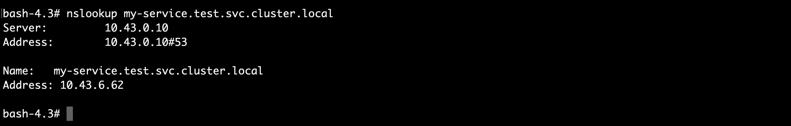
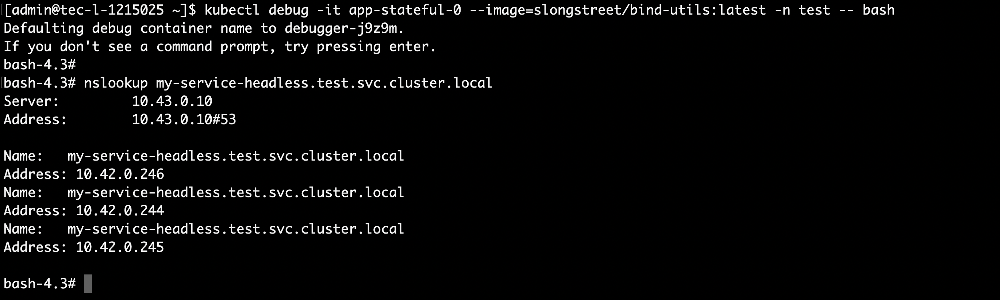
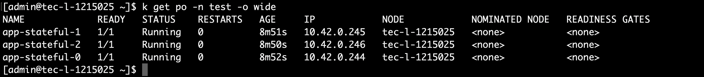
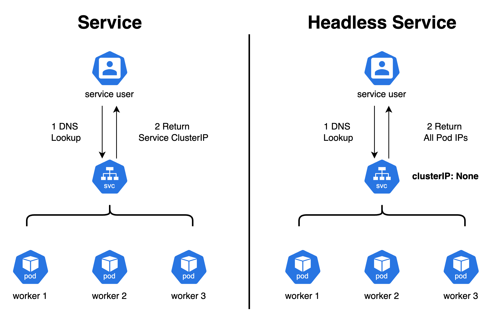
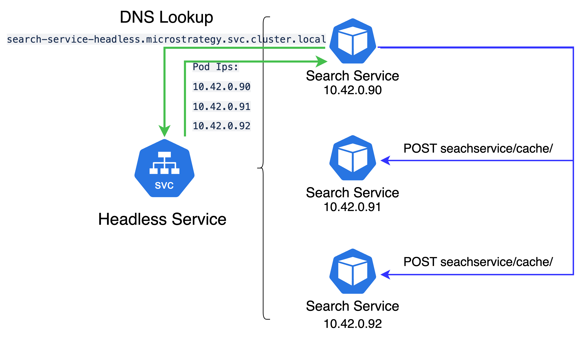

# Kubernetes 无头服务（Headless Service）在Pod同步上的实践

随着公司业务发展的需要，我们组新开发的搜索服务（Search Service， 部署在容器中），也提供了对多租户（Tenant）和多个Search Engine实例 （例如： ElasticSearch， Search Engine 实例提供底层搜索支持 ） 的支持。 为了提高搜索的响应速度，我们在SearchService里增加了对于 租户信息，以及Search Engine Instance信息的缓存。（这些信息同时会被持久化。）

然而，随着缓存的引入，麻烦也接踵而至。我们发现在高可用（HA）环境下，当其中一个Pod 上的搜索服务节点接收到了租户信息 （或者Search Engine Instance信息）变更请求之后，其他Pod上部署的搜索服务节点 却无法更新对应的缓存，导致了错误的发生。

为了解决这个问题，我们对Kubernetes 的无头服务（Headless Service）进行了探索和实践。

## 初识Kubernetes 无头服务（ Headless Service）
Service API 是 Kubernetes 的组成部分，它是一种抽象，帮助你将 Pod 集合在网络上公开出去。 每个服务 对象定义端点的一个逻辑集合（通常这些端点就是 Pod）以及如何访问到这些 Pod 的策略。

例如，考虑一个无状态的图像处理后端，其中运行 3 个副本（Replicas）。 这些副本是可互换的 —— 前端不需要关心它们调用的是哪个后端。 即便构成后端集合的实际 Pod 可能会发生变化，前端客户端不应该也没必要知道这些， 而且它们也不必亲自跟踪后端的状态变化。

Service 抽象使这种解耦成为可能。

### Kubernetes 服务（Service）
当我们用如下Spec来创建服务（Service）时，Kubernetes 会创建一个名叫 “my-service” 的服务，默认的服务类型（service type）是ClusterIP。Kubernetes 会给“my-service"分配一个IP 地址（称为 “Cluster IP”），供虚拟 IP 地址机制使用。

此 服务的控制器不断扫描与其选择算符匹配的 Pod 集合，然后对 Service 的 EndpointSlice 集合执行必要的更新
```
apiVersion: v1
kind: Service
metadata:
  name: my-service
spec:
  selector:
    app: web-stateful
  ports:
    - name: http
      protocol: TCP
      port: 80
      targetPort: 9376
```
Kubernetes 服务 的最常见用法是提供一种服务发现机制，能够让其他用户可以方便的和Service所服务的 pods 进行通信，而不用知道每个pod 具体的 IP 地址。

然而，在我们这种情况下，当其中一个 Pod 上的搜索服务的缓存信息发生更新时，当前的节点迫切的想要把缓存已经失效的信息通知给其他兄弟节点。由于一般的服务无法提供其他兄弟节点的IP地址，我们需要如何通知其他节点刷新缓存呢？Kubernetes 无头服务（Headless Service）便是解决这类问题的答案。

### Kubernetes 无头服务（Headless Service）

Kubernetes 无头服务是一种特殊的服务类型，它不会分配虚拟IP，而是直接暴露所有 Pod 的IP和 DNS 记录。这使得我们可以通过 IP 地址直接与各个 Pod 进行通信，并使用这些 IP 地址进行负载均衡。

我们可以指定ClusterIP为`None`,来创建无头服务
```
apiVersion: v1
kind: Service
metadata:
  name: my-service-headless
spec:
  clusterIP: None
  selector:
    app: web-stateful
  ports:
    - name: http
      protocol: TCP
      port: 80
      targetPort: 9377
```
我们可以发现对于无头服务，Kubernetes 并没有分配 Cluster IP。


### 工作原理

无头服务对 Kube-proxy 的影响主要体现在其负载均衡的实现方式上。在 Kubernetes 中，Kube-proxy 负责为 Service 提供负载均衡功能，以便客户端能够直接连接到任意一个 Pod。对于 ClusterIP 类型的 Service，Kube-proxy 会创建一个虚拟 IP 地址，并将请求发送到该地址所绑定的一个或多个 Pod 上。

而对于无头服务，Kube-proxy 创建的是一组 DNS 记录，用于解析到每个 Pod 的 IP 地址。这样，客户端就可以通过 DNS 解析来得到 Pod 的 IP 地址，并与它直接建立连接，完全绕过了 Kube-proxy 组件。

使用了 CoreDNS 的集群默认会配置自动服务发现，它能够根据 Service 和 Endpoint 对象自动生成 DNS 解析记录。对于普通的服务 对象，CoreDNS 会将其 ClusterIP 映射到一个域名下，这个域名为 `{service-name}.{namespace}.svc.cluster.local`。而对于 Headless Service，由于没有 Selector 对象，CoreDNS 将不会生成对应的 A 记录，只会生成 SRV 记录。

我们可以通过`nslookup`工具查看普通服务和无头服务的DNS记录。

对于普通的服务（Service），`nslookup` 只能显示服务（Service）自己的Cluster IP：


对于无头服务，`nslookup`可以返回解析后的与`my-service-headless`绑定的Pod 的ClusterIP：




具体来说，在使用了 CoreDNS 的 Kubernetes 集群中，对于 Headless Service，CoreDNS 会在域名 `.{service-name}.{namespace}.svc.cluster.local` 下生成一个 SRV 记录，这个记录包含了每个 Pod 的 IP 地址和端口号。客户端可以通过查询这个 SRV 记录来获取所有 Pod 的地址和端口号，并进行连接。换句话说，使用了 CoreDNS 的 Kubernetes 集群，Headless Service 可以正常工作，并且提供了更加灵活的负载均衡方式，客户端可以通过查询 SRV 记录，灵活选择需要连接的 Pod。


下图是Kubernetes Service 和 Kubernetes Headless Service的对比:



## 无头服务的实践

有了无头服务的理论基础，为了在所有搜索服务Pod 之间同步租户以及SearchEngine实例的缓存信息，我们引入了对应的无头服务。
```
{{- if .Values.enabled }}
apiVersion: v1
kind: Service
metadata:
  name: {{ template "common.fullname" . }}-headless
spec:
  type: ClusterIP
  clusterIP: None
  selector:
    app: {{ include "common.fullname" . }}
{{- end }}
```
每当其中一个Pod （例如 10.42.0.90）上的SearchService，完成了租户信息或者SearchEngine实例的更新之后， 当前节点便通过无头服务，获取其他 Pod 的 Cluster IP地址。随后向其他Pod，发送缓存失效请求。当再有请求分发到其他Pod 时，（例如 10.42.0.91）, 最新的租户信息或者Search Engine 实例信息便可以被使用.



注：

1. 无头服务的名称以及本Pod的 IP，可以通过环境变量传递给当前Pod。

2. POST searchserivce/cache是 搜索服务暴露的用来做缓存失效的API


## 踩到的坑 

### ISTIO环境下的无头服务配置
由于无头服务的主要功能是用来解析Pod 地址的，因此Kubernetes [允许](https://github.com/kubernetes/kubernetes/pull/67622)在定义无头服务的时候不指定端口号（port）。因此在第一个版本的无头服务的spec中，我们并没有指定端口号, 
```
{{- if .Values.enabled }}
apiVersion: v1
kind: Service
metadata:
  name: {{ template "common.fullname" . }}-headless
spec:
  type: ClusterIP
  clusterIP: None
  selector:
    app: {{ include "common.fullname" . }}
{{- end }}
```
然而，在实际部署过程中，我们却发现，从一个搜索服务的Pod 并不能发送cache失效请求给兄弟Pod。用curl命令从Pod 里面发送request，给其他兄弟Pod，遇到了如下报错
```
curl: (52) Empty reply from server
```

后来我们在查阅了 istio 的相关[文档](https://istio.io/latest/docs/ops/configuration/traffic-management/traffic-routing/#headless-services)之后发现了这样一段说明：
> Without Istio, the ports field of a headless service is not strictly required because requests go directly to pod IPs, which can accept traffic on all ports. However, with Istio the port must be declared in the Service, or it will not be matched.

即虽然Kubernetes对于无头服务的端口定义没有严格要求，但是在有istio部署的环境中，即使是无头服务，也必须定义端口信息；否则，对应的traffic 由于无法被istio匹配，就不会被istio正确的分发，从而导致上述的问题的发生。

我们的搜索服务 正是部署在一个有istio的环境中（istio 以sidecard的模式和Search Service 部署在同一个Pod 中）。因此，我们更正了无头服务的Spec
```
{{- if .Values.enabled }}
apiVersion: v1
kind: Service
metadata:
  name: {{ template "common.fullname" . }}-headless
spec:
  type: ClusterIP
  clusterIP: None
  selector:
    app: {{ include "common.fullname" . }}
  ports:
    - name: {{ .Values.name }}-port
      port: {{ .Values.service.port }}
      targetPort: {{ .Values.service.targetPort }}
{{- end }} 
```

## 小结
Kubernetes 无头服务提供了直接访问 Pod IP 地址的方式，对于各种数据共享的分布式应用以及需要做Pod 间同步的应用程序非常有用。与 ClusterIP类型的服务相比，它具有更高的动态扩展性和可扩展性。所以在 Kubernetes 服务 类型中 无头服务类型是一种非常有用的服务类型。然而由于无头服务本身只能通过DNS提供Round-Robin方式的负载均衡，对于需要做严格负载均衡控制的应用程序，需要慎重使用Kubernetes 的无头服务。

